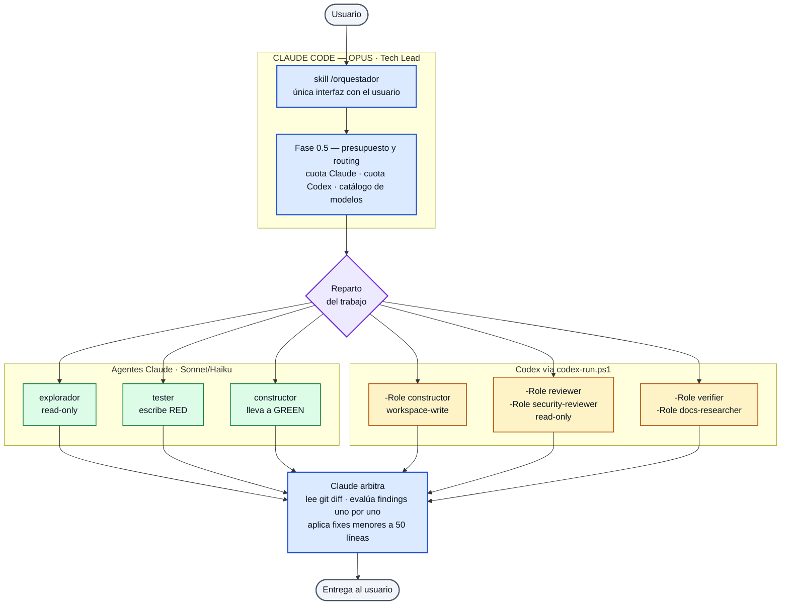
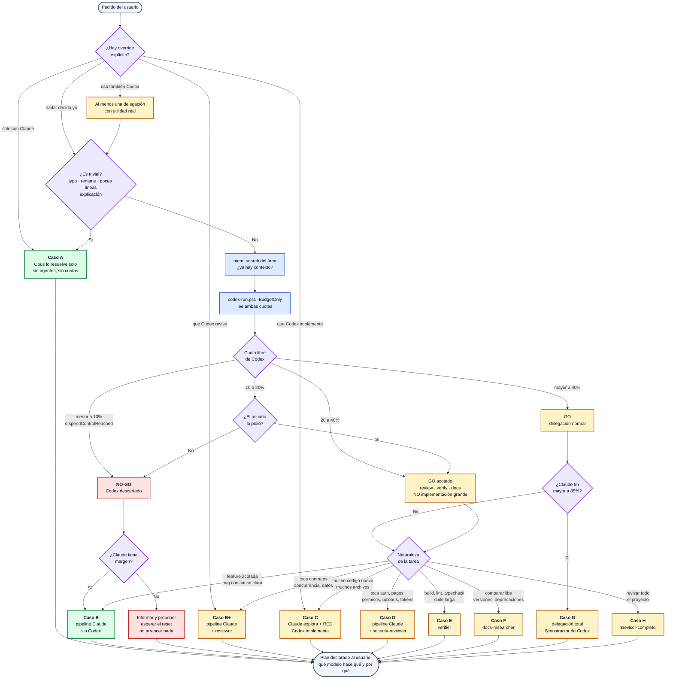
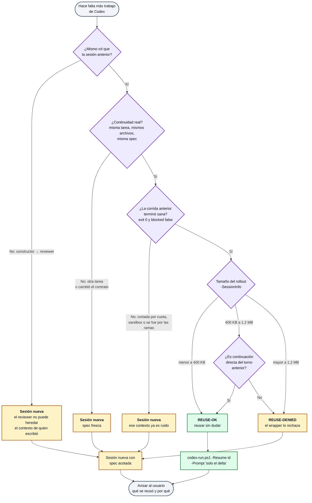
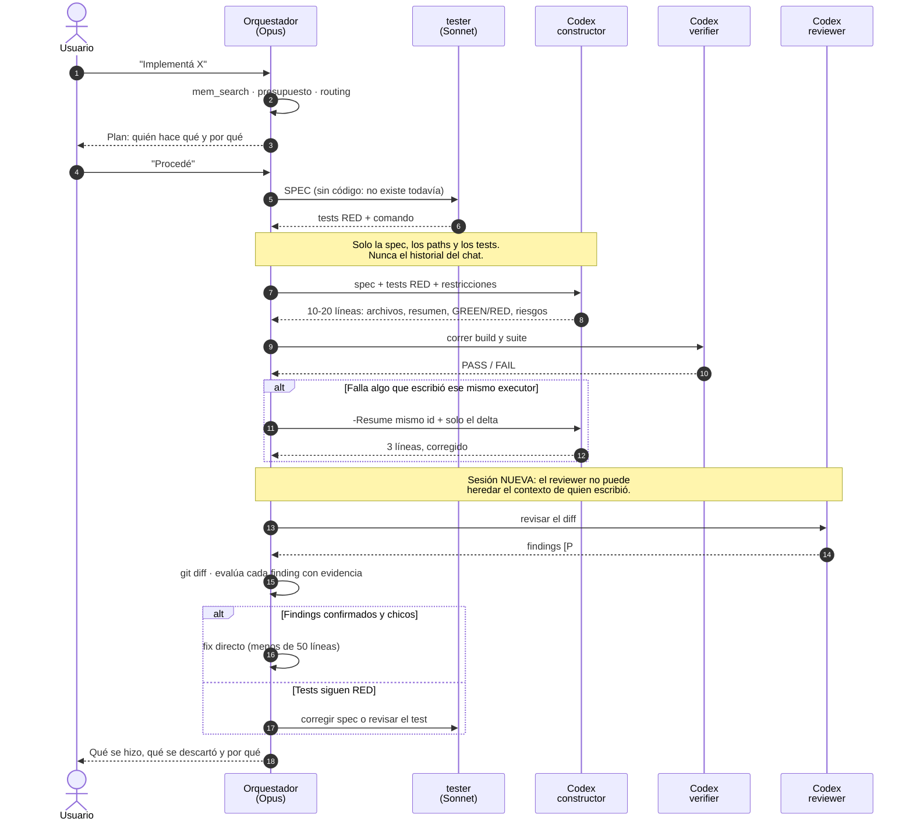

# Orquestador Híbrido — Claude Code + Codex

Un solo loop de ingeniería sobre dos suscripciones. Claude Opus es el Tech Lead y
la única interfaz con vos; Codex aporta capacidad exactamente donde mejora costo,
independencia de revisión o productividad.

---

## Índice

1. [Qué es y qué problema resuelve](#1-qué-es-y-qué-problema-resuelve)
2. [Arquitectura de un vistazo](#2-arquitectura-de-un-vistazo)
3. [Los roles](#3-los-roles)
4. [Cómo decide qué usar](#4-cómo-decide-qué-usar) — [árbol de decisión](#40-el-árbol-de-decisión-completo)
5. [Economía de contexto](#5-economía-de-contexto)
6. [TDD: por qué el que escribe el test no escribe el código](#6-tdd-por-qué-el-que-escribe-el-test-no-escribe-el-código)
7. [Memoria compartida (Engram)](#7-memoria-compartida-engram)
8. [Seguridad](#8-seguridad)
9. [Overrides: cómo forzar el comportamiento que quieras](#9-overrides)
10. [Observabilidad](#10-observabilidad)
11. [Ejemplos completos](#11-ejemplos-completos)
12. [Límites conocidos](#12-límites-conocidos)
13. [Registro de cambios](#13-registro-de-cambios)

---

## 1. Qué es y qué problema resuelve

Tenía dos entornos multiagente que funcionaban bien **por separado**: uno en
Claude Code y otro en Codex. Los dos estaban diseñados como orquestadores
completos, así que competían por el mismo rol. Usarlos juntos significaba abrir
dos terminales y coordinarlas a mano.

Este kit los fusiona con una regla estructural: **hay un solo Tech Lead, y es
Claude**. Codex deja de ser un orquestador y pasa a ser capacidad delegada.

Qué resuelve concretamente:

| Problema | Cómo lo resuelve |
|---|---|
| Una sola suscripción se agota | Routing consciente de presupuesto: lee la cuota real de ambos y decide |
| El que escribe el código revisa su propio código | El review lo hace otro proveedor, en otra sesión |
| Las implementaciones grandes queman el contexto de Claude | Se delegan a Codex, que devuelve 10–20 líneas |
| Coordinar dos agentes a mano | Un solo loop: vos hablás con Claude y nada más |
| Usar dos modelos para todo, aunque sea un typo | Routing adaptativo: lo trivial ni consulta cuotas |

**No** es una plataforma distribuida, ni tiene colas, dashboard, base de datos ni
protocolo propio. Es un script y unas reglas.

---

## 2. Arquitectura de un vistazo



Tres invariantes que sostienen todo:

1. **Un solo Tech Lead.** Cada invocación a Codex lleva `-c agents.enabled=false`,
   así que Codex no puede abrir su propio subloop.
2. **Un solo escritor a la vez.** Nunca el constructor de Claude y un executor de
   Codex sobre el mismo working tree. Los reviewers read-only sí van en paralelo.
3. **Codex nunca habla con el usuario.** Devuelve un contrato y se apaga.

---

## 3. Los roles

### 3.1 Claude

| Agente | Modelo | Qué hace |
|---|---|---|
| `/orquestador` (skill) | Opus | Habla con vos, decide, delega, arbitra, aplica fixes < ~50 líneas |
| `explorador` | Sonnet | Solo lectura. Localiza código, devuelve `archivo:línea` |
| `tester` | Sonnet | Escribe tests RED desde la spec. Solo toca archivos de test |
| `constructor` | Sonnet | Spec + RED → GREEN. No escribe sus propios tests |

Los tres subagentes tienen `Agent`/`Task` bloqueados: **solo el Orquestador
delega**. `tester` y `constructor` precargan la disciplina `ponytail`.

### 3.2 Codex

Se invocan con `codex-run.ps1 -Role <rol>`. Las instrucciones de cada rol salen
de `~/.codex/agents/<rol>.toml` — el kit de Codex sigue siendo la fuente de
verdad, no se duplican prompts.

| Rol | Tier | Sandbox | Cuándo |
|---|---|---|---|
| `constructor` | worker | workspace-write | Implementación voluminosa contra tests RED ya escritos |
| `reviewer` | worker / high | read-only | Correctness, regresiones, races, edge cases |
| `security-reviewer` | worker / high | read-only | auth, permisos, pagos, uploads, tokens, trust boundaries |
| `verifier` | cheap / low | workspace-write | build, lint, typecheck, suites largas |
| `docs-researcher` | cheap | read-only | Segunda opinión documental, versiones, deprecaciones |

**Roles deliberadamente no usados en el flujo híbrido:**

- `explorador` y `tester-tdd` de Codex — Claude ya los cubre, y su explorador
  tiene Serena (búsqueda semántica vía language server), que es mejor herramienta.
- `e2e-browser` y `browser-diagnostics` — solo bajo pedido explícito.
- Las skills `$constructor` y `$revisor-completo` son **orquestadores completos**.
  Se reservan para delegación total (rutas G y H), cuando Claude no participa.
  Usarlas cuando Claude ya hizo spec + exploración + RED duplicaría el razonamiento.

---

## 4. Cómo decide qué usar

### 4.0 El árbol de decisión completo

Este es el razonamiento que corre el Orquestador **antes** de tocar nada. Notá
que la mayoría de los caminos terminan sin levantar Codex: esa es la intención.



Tres cosas que vale la pena leer del diagrama:

- **El override del usuario corta primero.** Si decís "solo con Claude", ni
  siquiera se consulta la cuota.
- **Lo trivial sale por izquierda enseguida.** Un rename no pasa por el gate de
  presupuesto ni levanta un solo agente.
- **NO-GO no es un error.** Es una rama válida: Codex se descarta, Claude sigue,
  y solo si Claude *tampoco* tiene margen se propone esperar el reset.

### 4.1 Los casos A–H

| Caso | Ejemplos | Ejecuta | ¿Codex? |
|---|---|---|---|
| **A — trivial** | typo, rename, fix de pocas líneas, explicación | Opus directo | **No.** Ni consulta cuotas |
| **B — normal** | feature acotada, bug con causa clara | Pipeline Claude | No por defecto |
| **B+ — con riesgo** | toca contratos, concurrencia, datos | Pipeline Claude + reviewer | Sí, solo review |
| **C — voluminosa** | muchos archivos, mucho código nuevo | Claude RED → Codex GREEN | Sí, implementa |
| **D — seguridad** | auth, pagos, permisos, uploads | Pipeline + security-reviewer | Sí |
| **E — verificación cara** | build/lint/typecheck/suite larga | verifier | Sí |
| **F — investigación extensa** | comparar libs, migración de versión | docs-researcher | Sí |
| **G — delegación total** | Claude sin presupuesto, tarea autocontenida | `$constructor` de Codex | Sí, con subloop |
| **H — auditoría** | "revisá todo el proyecto" | `$revisor-completo` | Sí |

El caso A es el más importante del diseño: **la mayoría de los pedidos no
justifican nada de esto**, y el orquestador tiene que saber no hacer ruido.

### 4.2 Presupuesto: cómo lee las cuotas

Este fue el requisito que hizo todo lo demás posible. Ambos proveedores exponen
su consumo de forma legible:

**Codex** — método JSON-RPC oficial contra `codex app-server`:

```
initialize → initialized → account/rateLimits/read
```

```json
{"rateLimits":{"planType":"plus",
  "primary":{"usedPercent":20,"windowDurationMins":10080,"resetsAt":1787316765},
  "secondary":null,
  "credits":{"hasCredits":false,"balance":"0"},
  "spendControlReached":false,"rateLimitReachedType":null}}
```

`primary` es la ventana de 7 días (10080 min), `secondary` la corta cuando existe.
La respuesta puede traer varios límites en `rateLimitsByLimitId` (`codex`,
`codex_other`); el wrapper toma **la ventana más ajustada de todas**.

**Claude** — la statusline ya consulta `api.anthropic.com/api/oauth/usage` en cada
turno y cachea el resultado (TTL 60s) en
`%TEMP%\claude\statusline-usage-cache.json`. Leerlo es un `cat`, sin red propia
ni token nuevo:

```json
{"five_hour":{"utilization":72,"resets_at":"..."},
 "seven_day":{"utilization":22,"resets_at":"..."},
 "extra_usage":{"used_credits":3258.0,"monthly_limit":5000,"spend_limit_reached":false}}
```

**Umbrales:**

| Codex libre | Decisión |
|---|---|
| > 40% | GO — delegación normal, incluso implementación grande |
| 20–40% | GO acotado — review/verify/docs sí, implementación voluminosa no |
| 10–20% | WARN — solo si lo pedís explícitamente |
| < 10% | **NO-GO** — Codex descartado, Claude-only |
| `spendControlReached` | **NO-GO** duro |

Y al revés: si Claude está > 85% de su ventana de 5h y Codex tiene > 40% libre,
el orquestador **empuja el trabajo a Codex** y te dice por qué.

Si ninguno tiene margen, te informa y propone esperar el reset, en vez de arrancar
un pipeline que va a morir a la mitad.

```powershell
# Consultarlo a mano en cualquier momento:
powershell -File ~/.claude/scripts/codex-run.ps1 -BudgetOnly
```

```
== Presupuesto ==
Codex  : 80% libre (plan plus) - reset 2026-08-21 09:52
Claude : 5h 29% usado | 7d 25% usado - reset 2026-08-21T05:40:00Z
Decision: GO - Codex libre 80%. Delegacion normal.
```

### 4.3 Modelos: resolución por tier, sin IDs hardcodeados

Los modelos cambian cada mes. Escribir `gpt-5.6-terra` en un archivo de config es
una bomba de tiempo. El wrapper resuelve contra el **catálogo vivo**:

```powershell
codex debug models   # slug, visibility, priority, supported_reasoning_levels
```

Se filtran los `visibility == "list"`, se ordenan por `priority` y se asignan
por posición:

| Tier | Regla | Hoy resuelve a |
|---|---|---|
| `lead` | rank 1 | `gpt-5.6-sol` |
| `worker` | rank 2 (cae a rank 1 si no existe) | `gpt-5.6-terra` |
| `cheap` | rank 3 (cae a `worker` si no existe) | `gpt-5.6-luna` |

El `effort` pedido se valida contra los `supported_reasoning_levels` del modelo
resuelto; si no está soportado, cae al `default_reasoning_level`. Así un
`gpt-5.7-*` futuro, o un modelo que no soporte `ultra`, no rompen nada.

Del lado de Claude se usan los alias estables `opus` / `sonnet` / `haiku`.

---

## 5. Economía de contexto

Este es el objetivo principal, no un efecto secundario.

### 5.1 Qué se le pasa a Codex y qué no

**Sí:** objetivo y contrato, paths relevantes (rutas, no contenido), tests
relevantes (ruta + comando), restricciones, qué no hacer.

**No:** historial del chat, archivos completos, razonamientos de Claude, logs
largos, salidas de test irrelevantes.

### 5.2 Contratos de salida

Codex no devuelve el código que ya escribió en disco. El contrato lo fuerza un
JSON Schema pasado con `--output-schema`, no la buena voluntad del prompt:

```json
{"files_changed":[...],"summary":"...",
 "tests":{"command":"...","status":"GREEN|RED|NOT_RUN"},
 "risks":[...],"blocked":false}
```

Para review:

```json
{"findings":[{"severity":"P1","file":"a.ts","line":42,
              "problem":"...","impact":"...","fix":"..."}],
 "coverage_note":"..."}
```

Cómo se mantiene compacto:

1. `-o <archivo>` manda el mensaje final a disco; el wrapper imprime solo el JSON
   parseado (10–20 líneas).
2. `--json` va a un stream aparte, nunca al contexto de Claude.
3. Claude nunca pide "mostrame el código": lee `git diff` local, gratis.
4. Si no vuelve JSON válido, el wrapper trunca duro y te dice dónde está el resto.

### 5.3 Reutilización de sesiones

Una sesión de Codex ya cargada con el contexto de una tarea es un activo. Si
faltan 90 líneas más, reusarla cuesta un prompt de una línea; tirarla obliga a
re-explicar todo.

**Se reusa** (`-Resume <SESSION_ID>`) cuando se cumplen las tres:

1. **Continuidad real** — misma tarea, mismos archivos, misma spec.
2. **Sesión liviana** — no superó el umbral.
3. **La corrida anterior terminó sana** — exit 0 y `blocked: false`.

**Se arranca de cero** si es otra tarea, cambió el contrato, cambia el rol,
cambia el sandbox, o el working tree cambió por fuera de Codex.

> **Un reviewer nunca hereda la sesión del constructor.** Si el que revisa es el
> mismo que escribió, se pierde la independencia del review — que es medio motivo
> de usar Codex.



**El umbral** sale del tamaño del rollout en
`~/.codex/sessions/<año>/<mes>/<día>/rollout-<ts>-<SESSION_ID>.jsonl`. Los turnos
no discriminan (van de 2 a 4 en todos los casos); los bytes sí:

| Rollout | Decisión |
|---|---|
| < 400 KB | **Reusar** si hay continuidad |
| 400 KB – 1.2 MB | Reusar **solo si es continuación directa** |
| > 1.2 MB | **Sesión nueva** — el wrapper devuelve `REUSE-DENIED` |

```powershell
powershell -File ~/.claude/scripts/codex-run.ps1 -SessionInfo <id>
```

```
== Sesion 01a021ee-2fa6-7691-ba9f-d85c626bb5ca ==
Rollout  : 134 KB
Turnos   : 1
Veredicto: REUSE-OK  (libre <400KB, limite 1200KB)
```

> `--ephemeral` no persiste el rollout y deja la sesión irrecuperable. Se usa solo
> para one-shots genuinos (un review puntual, una consulta documental).

---

## 6. TDD: por qué el que escribe el test no escribe el código

El orden es duro y no se invierte:

```
tester (Claude, Sonnet) → tests RED desde la SPEC
        ↓
constructor (Claude o Codex) → GREEN, sin tocar los tests
        ↓
Claude revisa el diff
```

Existe para que el mismo agente que escribe el código no escriba el test a su
medida. En la variante híbrida (**Tester Claude → RED → Constructor Codex →
GREEN**) esa independencia además cruza proveedores, que es lo más fuerte que se
puede conseguir sin escribir los tests a mano.

Así se ve el caso C completo, con los dos puntos donde el ciclo puede volver atrás:



El arbitraje del paso final es el que sostiene todo: un finding **no** se acepta
porque lo dijo otro modelo, se acepta porque Claude lo verificó en el código.

Lo que **no** se hace: usar `tester-tdd` de Codex para una spec que el Tester de
Claude ya cubrió. Eso es duplicar razonamiento y tokens sin ganar independencia
—la que importa ya está.

Tampoco se hace TDD ritual para typos, documentación o configuración sin
comportamiento ejecutable.

---

## 7. Memoria compartida (Engram)

Claude y Codex comparten **una sola** base: `%USERPROFILE%\.engram\engram.db`.
No hay nada que configurar; ambos ya la tienen registrada.

La política evita duplicados en el origen, sin tener que reconciliar topic keys
entre proveedores:

- **Claude es el único que escribe decisiones.** Arquitectura, convenciones,
  gotchas de dominio, el "por qué se hizo así". Es el que tiene el contexto completo.
- **Codex es read-mostly.** Su prompt le dice: consultá si el área pudo haberse
  trabajado antes, pero **no guardes** — reportá el hallazgo en `risks` y el Tech
  Lead decide si merece persistirse.
- **Excepción:** en delegación total (rutas G y H) Codex sí guarda, porque ahí
  Claude no participó.

No se guarda: typos, cambios mecánicos, logs, resultados triviales.

---

## 8. Seguridad

### Git

Dos reglas duras: **publicar cambios es exclusivo del usuario**, y **los commits
solo bajo pedido explícito**. Sin atribución de IA en los mensajes.

Cuatro capas, porque una sola no alcanza:

| Capa | Qué cubre | Protege a |
|---|---|---|
| `~/.claude/settings.json` deny | Las formas directas | Claude |
| `~/.claude/hooks/git-guard.ps1` | **Todas**, incluidas `git -C` y `--git-dir=` | Claude |
| `~/.codex/rules/orquestador.rules` | Formas directas + `-C`/`--git-dir` como `prompt` | Codex |
| `~/.codex/hooks/orquestador-git-guard.ps1` | **Todas** | Codex |
| Prompt (SKILL.md / AGENTS.md) | Intención | Ambos |

**Un deny de Claude no protege al proceso Codex**: `codex exec` es un proceso hijo
con su propio motor de permisos. Por eso cada entorno necesita su propia capa.

> **Nota de diseño:** el mismo `git-guard.ps1` sirve en los dos entornos. El
> formato de salida de un hook `PreToolUse` de Codex
> (`hookSpecificOutput.permissionDecision = "deny"`) es idéntico al de Claude
> Code, así que el script se comparte sin cambios.

**Por qué hacen falta los hooks y no alcanzan las reglas.** El motor de
`execpolicy` de Codex solo expresa **prefijos de argv** — no tiene reglas por
regex. Eso significa que estas formas lo evaden por construcción:

```
git -C . push origin main      → el prefijo arranca con -C, no matchea ["git","push"]
git --git-dir=.git push        → idem
```

Verificable sin publicar nada:

```powershell
codex execpolicy check --rules ~/.codex/rules/orquestador.rules git -C . push origin main
```

El hook, en cambio, evalúa el string completo del comando con una expresión
regular que contempla `-C`, `-c`, `--git-dir`, `--work-tree`, `git.exe` y las
cadenas con `&&`. Está verificado contra las diez formas, incluidos los negativos
(`git status`, `npm run push-docs` y un commit cuyo mensaje contiene la palabra
no se bloquean).

### Invariantes del wrapper

Nunca pasa `--dangerously-bypass-approvals-and-sandbox`,
`--dangerously-bypass-hook-trust` ni `--ignore-rules`. Los tres desarman las
protecciones. Los reviewers van siempre `-s read-only`.

### Windows

Sandbox nativo `elevated`, `network_access = false`. El wrapper corre en
PowerShell 5.1 sin dependencias.

---

## 9. Overrides

| Le decís | Qué pasa |
|---|---|
| *"hacelo solo con Claude"* | Codex no se usa. Ni siquiera consulta cuota |
| *"usá también Codex"* | Al menos una delegación con utilidad real (no ritual) |
| *"que Codex implemente"* | Claude sigue liderando; Codex ejecuta |
| *"que Codex revise"* | Codex read-only como reviewer |
| nada | Claude decide según costo, complejidad, riesgo y beneficio |

---

## 10. Observabilidad

Un archivo, sin dashboard ni telemetría: `.orquestador/decisions.jsonl` en el repo
de trabajo, una línea por delegación.

```json
{"ts":"2026-08-20T22:26:35","task":"slugify","role":"constructor","tier":"worker",
 "model":"gpt-5.6-terra","effort":"medium","sandbox":"workspace-write",
 "reused":false,"session":{"id":"01a021ee-...","rollout_kb":134},
 "codex_free_pct":80,"claude_5h_used":29,"exit_code":0,"blocked":false,"findings":null}
```

Responde lo que importa: si la tarea fue Claude-only o híbrida, qué roles y
modelos se levantaron, cómo estaban las cuotas al decidir, si se reusó sesión y
cuánto había crecido, y cómo terminó.

---

## 11. Ejemplos completos

### Tarea mediana — "Implementá recuperación de contraseña"

```
Claude (Fase 0)   mem_search "auth password reset" → sin contexto previo
Claude (Fase 0.5) -BudgetOnly → Claude 5h 72% · Codex 7d 20% · GO
Claude (Fase 1)   2 preguntas: ¿mail o SMS? ¿expiración del token?
Claude (Fase 2)   explorador @sonnet → auth.ts:120, mailer.ts:45, riesgo: sesiones

Claude presenta:

  Plan de ejecución
  - Orquestador:        Claude Opus
  - Exploración:        Claude Sonnet          (hecho)
  - Tests RED:          Claude Sonnet
  - Implementación:     Codex worker/medium
  - Verificación:       Codex cheap/low
  - Review correctness: Codex worker/high
  - Review seguridad:   Codex worker/high      (toca auth y tokens)
  - Revisión final:     Claude Opus

  Por qué Codex: la implementación toca 6 archivos y ~300 líneas — sacarla de mi
  contexto ahorra presupuesto, y con mi ventana de 5h al 72% conviene usar la
  segunda suscripción. Además el review queda independiente del que escribió.

Usuario: "Procedé."

  tester @sonnet                     → 9 tests RED
  -Role constructor                  → 6 archivos, GREEN, sesión 312 KB
  -Role verifier                     → build FAIL: falta exportar resetToken

  Claude: el error es del código que escribió ese mismo executor y la sesión
  está liviana → continuación, no sesión nueva.
  -Resume <id> -Prompt "Falta exportar resetToken desde auth/index.ts."
                                     → 3 líneas, sesión 388 KB, build PASS

  -Role reviewer                     → sesión NUEVA (rol distinto)
                                     → 2 findings (P1 race, P2 log)
  -Role security-reviewer            → 1 finding (P1 token sin rate limit)

Claude revisa `git diff` y evalúa los 3 findings con evidencia:
  - P1 race        → confirmado, fix directo (18 líneas)
  - P1 rate limit  → confirmado, fix directo (11 líneas)
  - P2 log         → descartado, el logger ya redacta (logger.ts:88)

Suite GREEN. mem_save de la decisión de expiración.
Entrega: qué se hizo, qué se descartó y por qué. Sin commit (no lo pediste).
```

### Tarea trivial — "Renombrá `usr` a `user` en session.ts"

```
Claude (Fase 0.5) → caso A, ni siquiera consulta cuotas
Claude edita el archivo. Fin.

Sin explorador. Sin tester. Sin Codex. Sin línea en decisions.jsonl.
```

Que el segundo ejemplo sea así de corto es el punto. Un orquestador que levanta
seis agentes para un rename no es potente, es caro.

---

## 12. Límites conocidos

- **El guard bloquea comandos compuestos.** Si un comando de shell contiene la
  cadena que dispara la regla en cualquier parte, se deniega el comando entero.
  Es el comportamiento correcto, pero sorprende la primera vez.
- **`codex exec resume` no acepta `-C` ni `-s`.** Hereda cwd y sandbox de la
  sesión original. El wrapper ya lo contempla.
- **Un hook debe emitir solo el JSON del contrato en stdout.** Cualquier salida
  extra rompe la corrida y la cuelga hasta el timeout.
- **El tamaño del rollout es un proxy, no una medida exacta** de contexto
  consumido. Sirve para decidir reuso; no es un contador de tokens.
- **PowerShell 5.1 corre sobre .NET Framework**, que no tiene
  `ProcessStartInfo.ArgumentList` ni `StandardInputEncoding`. El wrapper arma el
  quoting de Windows a mano y escribe bytes UTF-8 al stream.
- **`Set-Content -Encoding UTF8` escribe BOM** en PS 5.1 y Codex rechaza el schema.
  El wrapper usa `UTF8Encoding($false)`.
- **El sandbox puede denegar intérpretes instalados desde la Microsoft Store**
  (el `python.exe` de WindowsApps). Codex lo reporta como riesgo y marca los
  tests `NOT_RUN` en vez de mentir un GREEN.
- **La cuota de Claude se lee del cache de la statusline.** Si desactivás la
  statusline, esa mitad del gate queda ciega (se trata como WARN, no como GO).

---

## 13. Registro de cambios

Ver [CHANGELOG.md](CHANGELOG.md).

Regla del proyecto: todo cambio en el comportamiento del orquestador (nuevo rol,
nuevo umbral, nueva regla de routing, nuevo fallback) actualiza este README y el
CHANGELOG **en el mismo diff**. Si no está documentado, no está terminado.

Para instalar: [INSTALL-HIBRIDO.md](INSTALL-HIBRIDO.md).
