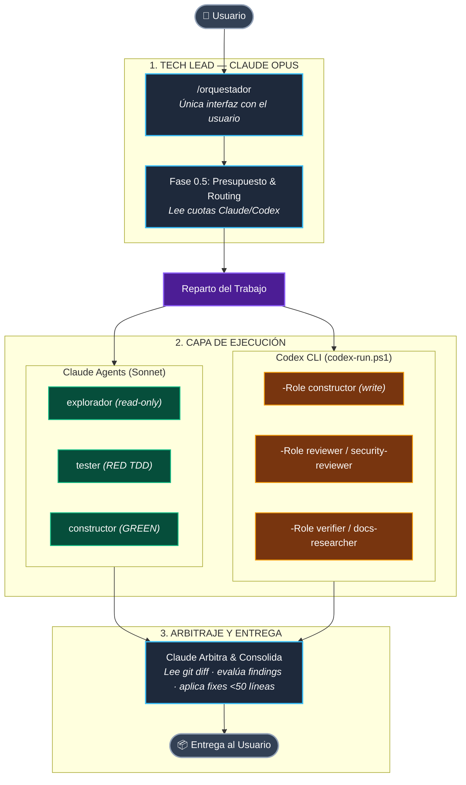
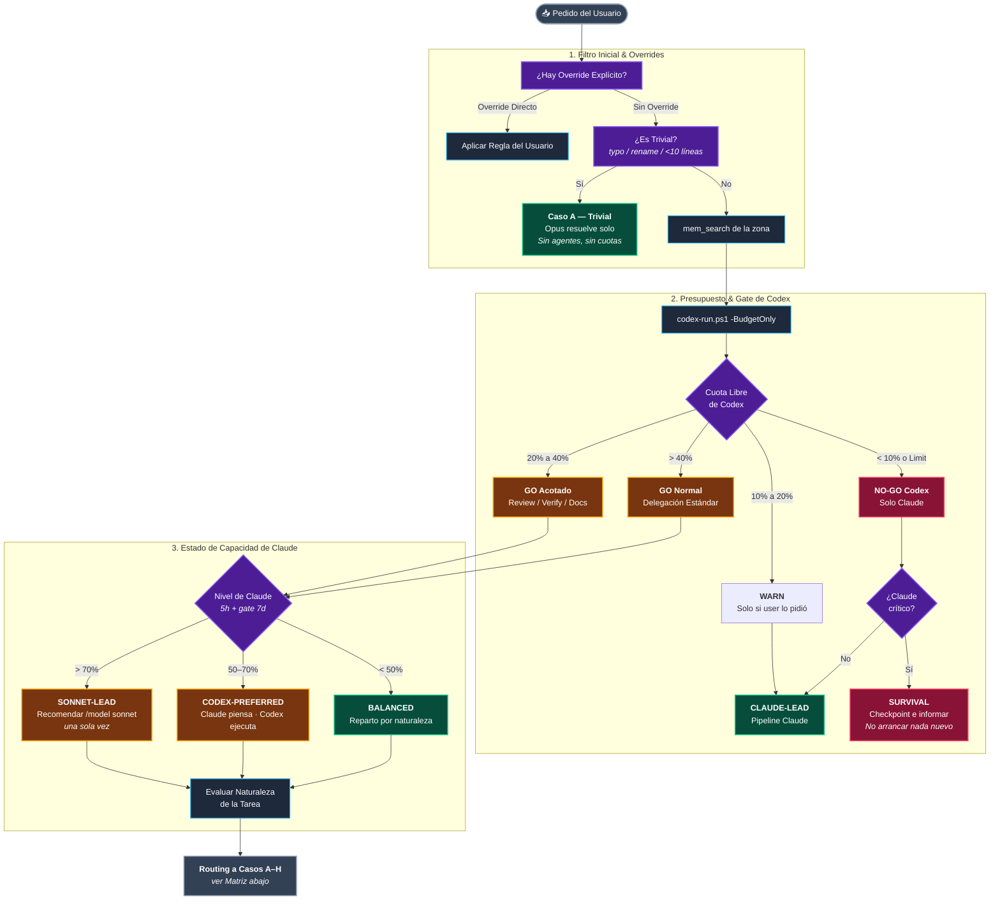
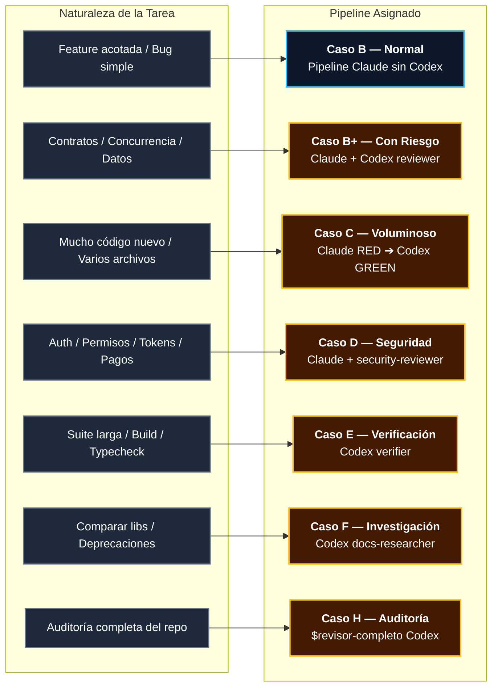
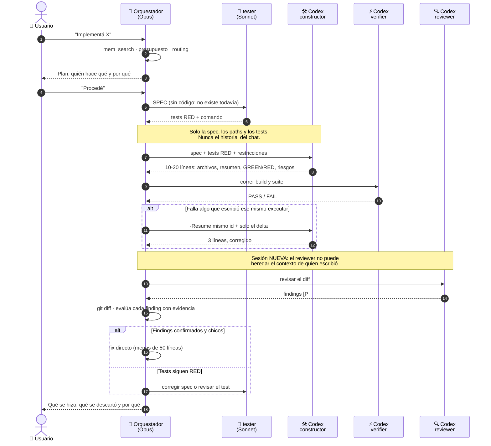

# Sistema — Orquestador Híbrido Claude + Codex

Estado actual del sistema. El porqué de cada decisión vive en
[`DECISIONS.md`](DECISIONS.md); lo que falta o está en curso, en
[`ROADMAP.md`](ROADMAP.md).

Índice: [1. Contexto](#1-contexto) · [2. Reglas de negocio](#2-reglas-de-negocio)
· [3. Arquitectura](#3-arquitectura) · [4. Flujos críticos](#4-flujos-críticos)
· [5. Datos](#5-datos) · [6. Integraciones](#6-integraciones) ·
[7. Seguridad](#7-seguridad)

---

## 1. Contexto

El kit orquesta dos entornos multiagente bajo un solo Tech Lead: Claude Opus
habla con el usuario, decide, delega y arbitra; Codex CLI aporta capacidad de
ejecución delegada vía `Orquestador/scripts/codex-run.ps1`.

**Actores:**

- **Usuario** — única fuente de pedidos y de aprobación para publicar cambios.
- **Claude Opus (`/orquestador`)** — Tech Lead. Única interfaz con el usuario.
- **Subagentes Claude (Sonnet)** — `explorador`, `tester`, `constructor`.
- **Roles Codex** — `constructor`, `reviewer`, `security-reviewer`, `verifier`,
  `docs-researcher`, invocados vía `codex-run.ps1 -Role <rol>`.

**Glosario:**

- **Ruta A–H** — el caso de routing que decide el orquestador para un pedido
  (ver § 3, tabla de casos).
- **Tier** — nivel de capacidad de modelo Codex (`lead`, `worker`, `cheap`),
  resuelto contra el catálogo vivo de modelos.
- **Rollout** — el archivo `.jsonl` donde Codex persiste una sesión; su tamaño
  en KB es el proxy que decide si una sesión se reusa.
- **Veredicto de presupuesto** — la decisión `GO` / `GO acotado` / `WARN` /
  `NO-GO` que produce el gate de cuotas antes de delegar a Codex.
- **Doc sync** — la actualización de `docs/SYSTEM.md`, `docs/DECISIONS.md`,
  `docs/ROADMAP.md` y `CHANGELOG.md` en el mismo diff que el cambio que documentan.

---

## 2. Reglas de negocio

### Presupuesto y routing

#### BR-001 — NO-GO por cuota agotada o por Codex ausente

Codex con menos de 10% libre, o con `spendControlReached`, produce veredicto
NO-GO. **Codex no instalado en la máquina produce el mismo NO-GO**, con una razón
propia que lo distingue del WARN de "`app-server` no responde": no es lo mismo que
Codex no conteste a que Codex no exista. La rama se evalúa antes de leer cuota
alguna, y el kit sigue funcionando en modo Claude-solo — el gate nunca bloquea.

Estado: Activa
Test: `Orquestador/tests/test-codex-run.ps1` — checks de degradación sin codex
Código: `Orquestador/scripts/codex-run.ps1` — `$MinFreePercent`, `Get-CodexCommand`, `Get-CodexVerdict`

#### BR-002 — Umbrales de veredicto

Entre 10% y 20% libre el veredicto es WARN; entre 20% y 40%, GO acotado (sin
implementación voluminosa); a partir de 40%, GO.

Estado: Activa
Test: —
Código: `Orquestador/scripts/codex-run.ps1` — `$CODEX_WARN_FREE`, `$CODEX_HEAVY_FREE`

| Codex libre | Decisión |
|---|---|
| > 40% | GO — delegación normal, incluso implementación grande |
| 20–40% | GO acotado — review/verify/docs sí, implementación voluminosa no |
| 10–20% | WARN — solo si se pide explícitamente |
| < 10% | **NO-GO** — Codex descartado, Claude-only |
| `spendControlReached` | **NO-GO** duro |
| `codex` ausente del PATH | **NO-GO** duro — kit en modo Claude-solo |

#### BR-003 — Estado de capacidad

El routing se resuelve en **dos capas independientes que se componen**. El
veredicto (BR-001, BR-002) responde *"¿se puede usar Codex, y para qué?"*; el
estado responde *"¿quién lleva el lead y quién ejecuta?"*.

El nivel de presión de Claude sale de sus dos ventanas:

| Claude 5h usado | Nivel |
|---|---|
| < 50% | `fresco` |
| 50–70% | `presionado` |
| 70–85% | `apretado` |
| ≥ 85% | `crítico` |

Una ventana de 7 días por encima del 80% sube el piso a `presionado` aunque la
de 5h esté fresca. El gate sube el nivel, nunca lo baja.

El estado sale de evaluar estas reglas **de arriba hacia abajo; la primera que
coincide gana**:

| # | Condición | Estado |
|---|---|---|
| 1 | Claude sin dato legible | `BALANCED` |
| 2 | `crítico` y Codex NO-GO o WARN | `SURVIVAL` |
| 3 | Codex NO-GO | `CLAUDE-LEAD` |
| 4 | `crítico` y Codex GO | `SONNET-LEAD` |
| 5 | `apretado` y Codex GO | `SONNET-LEAD` |
| 6 | `presionado` y Codex GO | `CODEX-PREFERRED` |
| 7 | Codex WARN | `CLAUDE-LEAD` |
| 8 | resto | `BALANCED` |

Las reglas 4–6 exigen veredicto `GO`: un `WARN` no alcanza para poner a Codex a
ejecutar por más apretado que esté Claude, y cae a la regla 7.

En `CODEX-PREFERRED` y `SONNET-LEAD`, un veredicto `GO` acotado sigue vetando la
implementación voluminosa: el estado decide quién ejecuta, el veredicto cuánto.

Estado: Activa
Test: `Orquestador/tests/test-codex-run.ps1` — 26 checks
Código: `Orquestador/scripts/codex-run.ps1` — `Get-ClaudeLevel`, `Add-CapacityState`

**La regla 1 se evalúa primera a propósito.** Sin lectura de la cuota de Claude
no se infiere ningún estado, ni siquiera con Codex en NO-GO, y el gate degrada al
comportamiento previo con un aviso. Un cache ausente y uno corrupto se tratan
igual. **El gate nunca bloquea al orquestador por no poder leer una cuota.**

Consultable a mano en cualquier momento:

```powershell
powershell -File ~/.claude/scripts/codex-run.ps1 -BudgetOnly
```

```
== Presupuesto ==
Codex  : 80% libre (plan plus) - reset 2026-08-21 09:52
Claude : 5h 58% usado | 7d 25% usado - reset 2026-08-21T05:40:00Z
Estado : CODEX-PREFERRED - Claude planifica y arbitra; ejecucion a Codex.
Decision: GO - Codex libre 80%. Delegacion normal.
```

#### BR-007 — Timeout de la consulta de cuota

La consulta de cuota expira a los 15 segundos.

Estado: Activa
Test: —
Código: `Orquestador/scripts/codex-run.ps1` — `$RPC_TIMEOUT_MS`, `Get-CodexQuota`

#### BR-008 — El retry lógico es el único que cuenta

Dos RED lógicos consecutivos del mismo executor sobre la misma unidad agotan los
intentos: no hay un tercero, se vuelve al contrato o a la spec.

Un RED lógico es código que corrió y dio un resultado incorrecto
(`tests.status: "RED"`). Las fallas de infraestructura, sandbox, red, tooling y
las salidas sin JSON válido llegan como `NOT_RUN`, `blocked: true` o exit code
distinto de 0, y **no consumen intentos**. Solo los lógicos se registran en
`retry_of`.

Estado: Activa
Test: —
Código: `Orquestador/skills/orquestador/SKILL.md` (criterio del orquestador)

### Overrides del usuario

| Le decís | Qué pasa |
|---|---|
| *"hacelo solo con Claude"* | Codex no se usa. Ni siquiera consulta cuota |
| *"usá también Codex"* | Al menos una delegación con utilidad real (no ritual) |
| *"que Codex implemente"* | Claude sigue liderando; Codex ejecuta |
| *"que Codex revise"* | Codex read-only como reviewer |
| nada | Claude decide según costo, complejidad, riesgo y beneficio |

### Qué se le pasa a Codex y qué no

**Sí:** objetivo y contrato, paths relevantes (rutas, no contenido), tests
relevantes (ruta + comando), restricciones, qué no hacer.

**No:** historial del chat, archivos completos, razonamientos de Claude, logs
largos, salidas de test irrelevantes.

### Contratos de salida

Codex no devuelve el código que ya escribió en disco. El contrato lo fuerza un
JSON Schema pasado con `--output-schema`, no la buena voluntad del prompt:

```json
{"files_changed":[...],"summary":"...",
 "tests":{"command":"...","status":"GREEN|RED|NOT_RUN"},
 "risks":[...],"blocked":false}
```

Para review:

```json
{"findings":[{"severity":"P1","file":"a.ts","line":42,
              "problem":"...","impact":"...","fix":"..."}],
 "coverage_note":"..."}
```

Cómo se mantiene compacto:

1. `-o <archivo>` manda el mensaje final a disco; el wrapper imprime solo el JSON
   parseado (10–20 líneas).
2. `--json` va a un stream aparte, nunca al contexto de Claude.
3. Claude nunca pide "mostrame el código": lee `git diff` local, gratis.
4. Si no vuelve JSON válido, el wrapper trunca duro y te dice dónde está el resto.

#### BR-006 — Truncado de salida sin JSON válido

La salida sin JSON válido se trunca a 20 líneas.

Estado: Activa
Test: —
Código: `Orquestador/scripts/codex-run.ps1` — `$MAX_OUTPUT_LINES`

### Reutilización de sesiones

**Se reusa** (`-Resume <SESSION_ID>`) cuando se cumplen las tres:

1. **Continuidad real** — misma tarea, mismos archivos, misma spec.
2. **Sesión liviana** — no superó el umbral.
3. **La corrida anterior terminó sana** — exit 0 y `blocked: false`.

**Se arranca de cero** si es otra tarea, cambió el contrato, cambia el rol,
cambia el sandbox, o el working tree cambió por fuera de Codex.

**Un reviewer nunca hereda la sesión del constructor.** Si el que revisa es el
mismo que escribió, se pierde la independencia del review — que es medio
motivo de usar Codex.

#### BR-004 — Umbral de reuso directo

Un rollout de menos de 400 KB es reusable (`REUSE-OK`).

Estado: Activa
Test: —
Código: `Orquestador/scripts/codex-run.ps1` — `$REUSE_FREE_KB`, `Get-SessionDetail`

#### BR-005 — Umbrales de reuso condicionado y denegado

Entre 400 KB y 1.2 MB solo se reusa para continuación directa
(`REUSE-IF-DIRECT`); por encima de 1.2 MB, sesión nueva (`REUSE-DENIED`).

Estado: Activa
Test: —
Código: `Orquestador/scripts/codex-run.ps1` — `$REUSE_LIMIT_KB`, `Get-SessionDetail`

El umbral sale del tamaño del rollout en
`~/.codex/sessions/<año>/<mes>/<día>/rollout-<ts>-<SESSION_ID>.jsonl`. Los turnos
no discriminan (van de 2 a 4 en todos los casos); los bytes sí:

| Rollout | Decisión |
|---|---|
| < 400 KB | **Reusar** si hay continuidad |
| 400 KB – 1.2 MB | Reusar **solo si es continuación directa** |
| > 1.2 MB | **Sesión nueva** — el wrapper devuelve `REUSE-DENIED` |

```powershell
powershell -File ~/.claude/scripts/codex-run.ps1 -SessionInfo <id>
```

```
== Sesion 01a021ee-2fa6-7691-ba9f-d85c626bb5ca ==
Rollout  : 134 KB
Turnos   : 1
Veredicto: REUSE-OK  (libre <400KB, limite 1200KB)
```

`--ephemeral` no persiste el rollout y deja la sesión irrecuperable. Se usa solo
para one-shots genuinos (un review puntual, una consulta documental).

### Disciplina del orquestador

Reglas de criterio, no verificables contra código — sin ID:

- Un fix directo aplicado por el orquestador se limita a menos de ~50 líneas;
  por encima de eso se delega.
- Un solo escritor a la vez sobre el working tree: nunca el constructor de
  Claude y un executor de Codex en paralelo. Los reviewers read-only sí van
  en paralelo.
- El reviewer nunca hereda la sesión del constructor.
- El wrapper no pasa nunca flags de bypass (`--dangerously-bypass-*`,
  `--ignore-rules`).
- Publicar cambios (`git push`) es exclusivo del usuario; `git commit` solo
  bajo pedido explícito, sin atribución de IA en los mensajes.

---

## 3. Arquitectura

### Vista general



**Tres invariantes estructurales:**

1. **Un solo Tech Lead.** Cada invocación a Codex lleva `-c agents.enabled=false`, así que Codex no puede abrir su propio subloop.
2. **Un solo escritor a la vez.** Nunca el constructor de Claude y un executor de Codex sobre el mismo working tree. Los reviewers read-only sí van en paralelo.
3. **Codex nunca habla con el usuario.** Devuelve un contrato estricto de salida y se apaga.

### Roles Claude

| Agente | Modelo | Qué hace |
|---|---|---|
| `/orquestador` (skill) | Opus | Habla con vos, decide, delega, arbitra, aplica fixes < ~50 líneas |
| `explorador` | Sonnet | Solo lectura. Entiende un flujo completo y devuelve contrato, riesgos y `archivo:línea` |
| `tester` | Sonnet | Escribe tests RED desde la spec. Solo toca archivos de test |
| `constructor` | Sonnet | Spec + RED → GREEN. No escribe sus propios tests |

Los tres subagentes tienen `Agent`/`Task` bloqueados: **solo el Orquestador
delega**. `tester` y `constructor` precargan la disciplina `ponytail`.

**`explorador` no es el default para localizar código.** La exploración sube una
escalera de costo y para en el primer escalón que alcanza: `git ls-files` para la
estructura del repo, Serena para símbolos y referencias, `Grep` para texto, y
recién el `explorador` LLM para entender un flujo completo con sus riesgos y su
contrato. Cuando se levanta, recibe scope dirigido —entrypoints concretos y qué
devolver—, no un área.

### Roles Codex

Se invocan con `codex-run.ps1 -Role <rol>`. Las instrucciones de cada rol salen
de `~/.codex/agents/<rol>.toml` — el kit de Codex es la fuente de verdad, no se
duplican prompts.

| Rol | Tier | Sandbox | Cuándo |
|---|---|---|---|
| `constructor` | worker | workspace-write | Implementación voluminosa contra tests RED ya escritos |
| `reviewer` | worker / high | read-only | Correctness, regresiones, races, edge cases |
| `security-reviewer` | worker / high | read-only | auth, permisos, pagos, uploads, tokens, trust boundaries |
| `verifier` | cheap / low | workspace-write | build, lint, typecheck, suites largas |
| `docs-researcher` | cheap | read-only | Segunda opinión documental, versiones, deprecaciones |

Por qué esos cinco roles y no los demás del kit Codex (`explorador`,
`tester-tdd`, `e2e-browser`, `browser-diagnostics`, `$constructor`,
`$revisor-completo`) → [DECISIONS.md § D-002](DECISIONS.md#d-002--roles-de-codex-deliberadamente-no-usados-en-el-flujo-híbrido).

### Los casos A–H

| Caso | Ejemplos | Ejecuta | ¿Codex? |
|---|---|---|---|
| **A — trivial** | typo, rename, fix de pocas líneas, explicación | Opus directo | **No.** Ni consulta cuotas |
| **B — normal** | feature acotada, bug con causa clara | Pipeline Claude | No por defecto |
| **B+ — con riesgo** | toca contratos, concurrencia, datos | Pipeline Claude + reviewer | Sí, solo review |
| **C — voluminosa** | muchos archivos, mucho código nuevo | Claude RED → Codex GREEN | Sí, implementa |
| **D — seguridad** | auth, pagos, permisos, uploads | Pipeline + security-reviewer | Sí |
| **E — verificación cara** | build/lint/typecheck/suite larga | verifier | Sí |
| **F — investigación extensa** | comparar libs, migración de versión | docs-researcher | Sí |
| **G — delegación total** | Tarea autocontenida que no necesita arbitraje, con Claude apretado | `$constructor` de Codex | Sí, con subloop |
| **H — auditoría** | "revisá todo el proyecto" | `$revisor-completo` | Sí |

### Resolución de modelos por tier

El wrapper resuelve los modelos de Codex contra el **catálogo vivo**, sin IDs
hardcodeados:

```powershell
codex debug models   # slug, visibility, priority, supported_reasoning_levels
```

Se filtran los `visibility == "list"`, se ordenan por `priority` y se asignan
por posición:

| Tier | Regla | Hoy resuelve a |
|---|---|---|
| `lead` | rank 1 | `gpt-5.6-sol` |
| `worker` | rank 2 (cae a rank 1 si no existe) | `gpt-5.6-terra` |
| `cheap` | rank 3 (cae a `worker` si no existe) | `gpt-5.6-luna` |

El `effort` pedido se valida contra los `supported_reasoning_levels` del modelo
resuelto; si no está soportado, cae al `default_reasoning_level`. Así un
`gpt-5.7-*` futuro, o un modelo que no soporte `ultra`, no rompen nada.

Del lado de Claude se usan los alias estables `opus` / `sonnet` / `haiku`.

### Límites conocidos

- **El guard bloquea comandos compuestos.** Si un comando de shell contiene la
  cadena que dispara la regla en cualquier parte, se deniega el comando entero.
  Es el comportamiento correcto, pero sorprende la primera vez.
- **`codex exec resume` no acepta `-C` ni `-s`.** Hereda cwd y sandbox de la
  sesión original. El wrapper ya lo contempla.
- **Un hook debe emitir solo el JSON del contrato en stdout.** Cualquier salida
  extra rompe la corrida y la cuelga hasta el timeout.
- **El tamaño del rollout es un proxy, no una medida exacta** de contexto
  consumido. Sirve para decidir reuso; no es un contador de tokens.
- **PowerShell 5.1 corre sobre .NET Framework**, que no tiene
  `ProcessStartInfo.ArgumentList` ni `StandardInputEncoding`. El wrapper arma el
  quoting de Windows a mano y escribe bytes UTF-8 al stream.
- **`Set-Content -Encoding UTF8` escribe BOM** en PS 5.1 y Codex rechaza el schema.
  El wrapper usa `UTF8Encoding($false)`.
- **El sandbox puede denegar intérpretes instalados desde la Microsoft Store**
  (el `python.exe` de WindowsApps). Codex lo reporta como riesgo y marca los
  tests `NOT_RUN` en vez de mentir un GREEN.
- **La cuota de Claude se lee del cache de la statusline.** Si desactivás la
  statusline, esa mitad del gate queda ciega (se trata como WARN, no como GO).

---

## 4. Flujos críticos

### Gate de presupuesto y routing

#### Macro-Flujo y Presupuesto (Gate System)



#### Matriz de Routing por Naturaleza de la Tarea



### TDD híbrido — caso C

El orden es duro y no se invierte:

```
tester (Claude, Sonnet) → tests RED desde la SPEC
        ↓
constructor (Claude o Codex) → GREEN, sin tocar los tests
        ↓
Claude revisa el diff
```

Así se ve el caso C completo, con los dos puntos donde el ciclo puede volver atrás:



---

## 5. Datos

### Memoria compartida (Engram)

Claude y Codex comparten **una sola** base: `%USERPROFILE%\.engram\engram.db`.
No hay nada que configurar; ambos ya la tienen registrada.

La política evita duplicados en el origen, sin tener que reconciliar topic keys
entre proveedores:

- **Claude es el único que escribe decisiones.** Arquitectura, convenciones,
  gotchas de dominio, el "por qué se hizo así". Es el que tiene el contexto completo.
- **Codex es read-mostly.** Su prompt le dice: consultá si el área pudo haberse
  trabajado antes, pero **no guardes** — reportá el hallazgo en `risks` y el Tech
  Lead decide si merece persistirse.
- **Excepción:** en delegación total (rutas G y H) Codex sí guarda, porque ahí
  Claude no participó.

No se guarda: typos, cambios mecánicos, logs, resultados triviales.

### Observabilidad

Un archivo, sin dashboard ni telemetría: `.orquestador/decisions.jsonl` en el repo
de trabajo, una línea por delegación.

```json
{"ts":"2026-08-20T22:26:35","task":"slugify","role":"constructor","tier":"worker",
 "model":"gpt-5.6-terra","effort":"medium","sandbox":"workspace-write",
 "reused":false,"session":{"id":"01a021ee-...","rollout_kb":134},
 "codex_free_pct":80,"claude_5h_used":29,"claude_7d_used":25,
 "state":"CODEX-PREFERRED","phase":"construct","retry_of":null,
 "exit_code":0,"blocked":false,"findings":null}
```

Responde lo que importa: si la tarea fue Claude-only o híbrida, qué roles y
modelos se levantaron, cómo estaban las cuotas y el estado al decidir, si se
reusó sesión y cuánto había crecido, y cómo terminó.

`phase` y `retry_of` los pasa el orquestador (`-Phase`, `-RetryOf`); el resto
sale del wrapper. `retry_of` registra **solo reintentos por RED lógico**
(BR-008): una falla de sandbox o de red no es un retry.

No hay script agregador. La pregunta que estos campos existen para responder es
una sola —**cuántas veces se llegó a `SURVIVAL` con Codex sano**— y se contesta
desde la terminal:

```powershell
Get-Content .orquestador\decisions.jsonl | ConvertFrom-Json | Group-Object state
```

---

## 6. Integraciones

### Codex — cuota vía JSON-RPC

Método JSON-RPC oficial contra `codex app-server`:

```
initialize → initialized → account/rateLimits/read
```

```json
{"rateLimits":{"planType":"plus",
  "primary":{"usedPercent":20,"windowDurationMins":10080,"resetsAt":1787316765},
  "secondary":null,
  "credits":{"hasCredits":false,"balance":"0"},
  "spendControlReached":false,"rateLimitReachedType":null}}
```

`primary` es la ventana de 7 días (10080 min), `secondary` la corta cuando existe.
La respuesta puede traer varios límites en `rateLimitsByLimitId` (`codex`,
`codex_other`); el wrapper toma **la ventana más ajustada de todas**.

### Claude — cuota vía cache de statusline

La statusline consulta `api.anthropic.com/api/oauth/usage` en cada turno y
cachea el resultado (TTL 60s) en `%TEMP%\claude\statusline-usage-cache.json`.
Leerlo es un `cat`, sin red propia ni token nuevo:

```json
{"five_hour":{"utilization":72,"resets_at":"..."},
 "seven_day":{"utilization":22,"resets_at":"..."},
 "extra_usage":{"used_credits":3258.0,"monthly_limit":5000,"spend_limit_reached":false}}
```

---

## 7. Seguridad

### Git

Dos reglas duras: **publicar cambios es exclusivo del usuario**, y **los commits
solo bajo pedido explícito**. Sin atribución de IA en los mensajes.

Cuatro capas, porque una sola no alcanza:

| Capa | Qué cubre | Protege a |
|---|---|---|
| `~/.claude/settings.json` deny | Las formas directas | Claude |
| `~/.claude/hooks/git-guard.ps1` | **Todas**, incluidas `git -C` y `--git-dir=` | Claude |
| `~/.codex/rules/orquestador.rules` | Formas directas + `-C`/`--git-dir` como `prompt` | Codex |
| `~/.codex/hooks/orquestador-git-guard.ps1` | **Todas** | Codex |
| Prompt (SKILL.md / AGENTS.md) | Intención | Ambos |

**Un deny de Claude no protege al proceso Codex**: `codex exec` es un proceso hijo
con su propio motor de permisos. Por eso cada entorno necesita su propia capa.

La regla de git está declarada en tres capas de prompt/policy distintas, y **no
se deduplica**: `codex/Orquestador/.codex/rules/orquestador.rules` (execpolicy),
`codex/Orquestador/AGENTS.md` (prompt de Codex),
`Orquestador/skills/orquestador/SKILL.md` (prompt de Claude), más el hook
`Orquestador/hooks/git-guard.ps1`.

Verificable sin publicar nada:

```powershell
codex execpolicy check --rules ~/.codex/rules/orquestador.rules git -C . push origin main
```

El hook evalúa el string completo del comando con una expresión regular que
contempla `-C`, `-c`, `--git-dir`, `--work-tree`, `git.exe` y las cadenas con
`&&`. Está verificado contra las diez formas, incluidos los negativos
(`git status`, `npm run push-docs` y un commit cuyo mensaje contiene la palabra
no se bloquean).

### Invariantes del wrapper

Nunca pasa `--dangerously-bypass-approvals-and-sandbox`,
`--dangerously-bypass-hook-trust` ni `--ignore-rules`. Los tres desarman las
protecciones. Los reviewers van siempre `-s read-only`.

### Windows

Sandbox nativo `elevated`, `network_access = false`. El wrapper corre en
PowerShell 5.1 sin dependencias.
