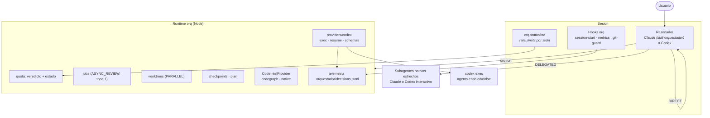
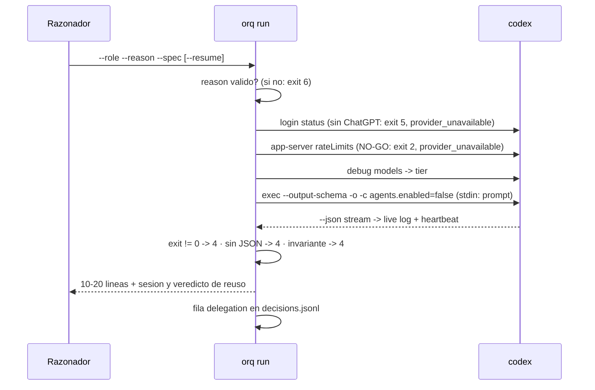

# Sistema — Orquestador V2 (Claude Code + Codex)

Estado actual del sistema. El porqué de cada decisión vive en
[`DECISIONS.md`](DECISIONS.md); lo que falta, en [`ROADMAP.md`](ROADMAP.md).

Índice: [1. Contexto](#1-contexto) · [2. Reglas de negocio](#2-reglas-de-negocio)
· [3. Arquitectura](#3-arquitectura) · [4. Flujos críticos](#4-flujos-críticos)
· [5. Datos](#5-datos) · [6. Integraciones](#6-integraciones) ·
[7. Seguridad](#7-seguridad)

---

## 1. Contexto

Un **razonador principal por tarea** — Claude o Codex, según desde dónde se
trabaje — entiende el objetivo, planifica, decide qué delegar y arbitra. La
delegación es la excepción y tiene que nombrar su motivo. El runtime `orq`
(Node/TypeScript, sin dependencias de runtime) aporta lo mecánico: instalación,
proveedores, cuota, contratos, jobs, worktrees, checkpoints y telemetría. La
política vive en la skill.

**Actores:**

- **Usuario** — única fuente de pedidos y de aprobación para publicar cambios.
- **Razonador** — la sesión principal (Claude Code con la skill `orquestador`, o
  Codex con su skill `orquestador`). Única interfaz con el usuario.
- **Subagentes Claude** — `explorador`, `tester`, `constructor` (Sonnet/Haiku).
- **Roles Codex** — `constructor`, `tester-tdd`, `verifier`, `reviewer`,
  `security-reviewer`, `docs-researcher`, vía `orq run --role <rol>`.

**Glosario:**

- **Topología** — DIRECT, DELEGATED, ASYNC_REVIEW o PARALLEL (§ 3).
- **Motivo de delegación** — uno de seis: `parallelism`, `isolation`,
  `independence`, `volume`, `specialization`, `broad_exploration`.
- **Tier** — nivel de modelo Codex (`lead`, `worker`, `cheap`), resuelto contra
  el catálogo vivo.
- **Rollout** — el `.jsonl` donde Codex persiste una sesión; su tamaño decide si
  se reusa.
- **Veredicto / estado** — las dos capas del gate de presupuesto (§ 2).
- **Checkpoint** — FAST (determinista) o DEEP (FAST + review adversarial).

---

## 2. Reglas de negocio

### Presupuesto

#### BR-001 — NO-GO por cuota agotada o por Codex ausente

Codex con menos de 10% libre, con `spendControlReached`/`rateLimitReachedType`, o
ausente del PATH, produce NO-GO. "Codex ausente" tiene razón propia, distinta del
WARN de "`app-server` no responde". El gate nunca bloquea al razonador.

Estado: Activa
Test: `test/quota.test.ts`, `test/run.test.ts` — "sin codex instalado"
Código: `src/core/quota.ts` — `codexVerdict`

#### BR-002 — Umbrales de veredicto

| Codex libre | Veredicto |
|---|---|
| ≥ 40% | GO — delegación normal, incluso implementación grande |
| 20–40% | GO acotado — review/verify/docs sí, implementación voluminosa no |
| 10–20% | WARN — solo si el usuario lo pide |
| < 10% | NO-GO |

Estado: Activa
Test: `test/quota.test.ts` — bordes exactos (mover un umbral lo pone en RED)
Código: `src/core/quota.ts` — `CODEX_MIN_FREE`, `CODEX_WARN_FREE`, `CODEX_HEAVY_FREE`

#### BR-003 — Estado de capacidad

Nivel de Claude por su ventana de 5h: `< 50` fresco · `50–70` presionado ·
`70–85` apretado · `≥ 85` crítico. La ventana de 7 días por encima de 80 sube el
piso a presionado; nunca lo baja. Reglas en orden, la primera gana:

| # | Condición | Estado |
|---|---|---|
| 1 | Claude sin dato legible | `BALANCED` |
| 2 | crítico y Codex NO-GO o WARN | `SURVIVAL` |
| 3 | Codex NO-GO | `CLAUDE-LEAD` |
| 4–5 | crítico o apretado, y Codex GO | `SONNET-LEAD` |
| 6 | presionado y Codex GO | `CODEX-PREFERRED` |
| 7 | Codex WARN | `CLAUDE-LEAD` |
| 8 | resto | `BALANCED` |

En `CODEX-PREFERRED` y `SONNET-LEAD`, un GO acotado sigue vetando el volumen: el
estado decide quién ejecuta, el veredicto cuánto.

Estado: Activa
Test: `test/quota.test.ts` — 8 reglas, 4 pares de precedencia, bordes de nivel, gate 7d
Código: `src/core/quota.ts` — `claudeLevel`, `capacityState`

#### BR-007 — Timeout de la consulta de cuota

La consulta por JSON-RPC expira a los 15 s (5 s en el hook de inicio de sesión).
Sin respuesta, el veredicto es WARN.

Estado: Activa
Código: `src/providers/codex.ts` — `RPC_TIMEOUT_MS`, `fetchCodexQuota`

#### BR-016 — El gate corre solo al iniciar la sesión

El hook `SessionStart` calcula veredicto y estado, los registra (`event: gate`)
y los deja en el contexto en dos líneas. El razonador no decide si consultarlo.

Estado: Activa
Test: `test/telemetry.test.ts` — "el gate que no corrio se ve en el reporte"
Código: `src/commands/hook.ts` — `sessionStartContext`

### Delegación y topologías

#### BR-017 — Default NO DELEGATION, con motivo nombrado

Toda delegación a Codex exige `--reason` de un set cerrado de seis motivos; sin
motivo, `orq run` sale con uso inválido (exit 6). Las decisiones de no delegar se
registran con `orq metrics --decision not_delegated --reason <motivo>`
(`already_had_context`, `too_small`, `coupled`, `spec_cost_exceeds_work`,
`provider_unavailable`, `user_override`). Un NO-GO o una falta de auth se
registran solos como `provider_unavailable`.

Estado: Activa
Test: `test/run.test.ts` — "sin --reason no se delega", "NO-GO por cuota"
Código: `src/commands/run.ts`, `src/core/telemetry.ts` — `DELEGATED`, `NOT_DELEGATED`

#### BR-018 — ASYNC_REVIEW: un reviewer activo por tarea

`orq run --background` solo acepta roles read-only y exige `--task`. Un segundo
reviewer activo sobre la misma tarea se rechaza (exit 7) nombrando el job en
curso. Un job cuyo proceso murió no bloquea. El tope sube solo con
`asyncReview.maxConcurrent` explícito en `orq.config.json`. La admisión es
atómica: chequeo del tope, alta del job y publicación del PID van bajo un lock
exclusivo por tarea (`mkdir`) con dueño: un lock viejo se recupera solo si el
proceso que lo tomó murió, y solo lo suelta quien lo tomó. El launcher relee el
job antes de publicar el PID para no pisar un estado final que el hijo ya escribió.

Estado: Activa
Test: `test/run.test.ts` — "ASYNC_REVIEW: el segundo reviewer ... se RECHAZA",
"8 lanzamientos simultáneos … exactamente 1 admitido"
Código: `src/commands/run.ts` — `launchBackground`; `src/core/jobs.ts`

#### BR-019 — Un escritor por región de archivos

Dos unidades sin archivos en común pueden escribir en paralelo. Si las dos
escriben en el mismo repo, la segunda va en un worktree (`orq worktree add`).
Nunca merge automático; `remove` se niega con cambios sin commitear y conserva
la branch si no está integrada.

Estado: Activa (la región es criterio del razonador; el aislamiento, código)
Test: `test/runtime.test.ts` — "worktree: crear, detectar existente, negarse a borrar…"
Código: `src/commands/worktree.ts`

### Contratos de salida

Codex no devuelve el código que escribió en disco. El contrato lo fuerza un JSON
Schema (`--output-schema`), no el prompt:

```json
{"files_changed":[], "summary":"", "tests":{"command":"","status":"GREEN|RED|NOT_RUN"},
 "risks":[], "blocked":false, "status":"DONE|NEEDS_INFO|BLOCKED",
 "clarifications":[{"missing_fact":"","evidence_checked":[],"question":"","affected_decision":""}]}
```

Review:

```json
{"findings":[{"severity":"P0|P1|P2|P3","file":"","line":0,"problem":"","impact":"",
              "evidence":"","suggested_fix":""}], "coverage_note":""}
```

#### BR-006 — Truncado de salida sin JSON válido

Sin JSON válido, se muestran 20 líneas y la ruta del resto (exit 4).

Estado: Activa
Test: `test/run.test.ts` — "JSON corrupto"
Código: `src/providers/codex.ts` — `MAX_RAW_LINES`

#### BR-011 — Estados de resultado estructurados

`DONE` y `NEEDS_INFO` van con `blocked=false`; `BLOCKED` con `blocked=true`.
`DONE` exige `clarifications` vacío; `NEEDS_INFO`, al menos una. Todo payload se
valida además estructuralmente contra el schema de su rol. Un payload que no
cumple es contrato violado (exit 4), nunca un crash. Un exit ≠ 0 de `codex exec` es fallo aunque
haya JSON en `-o`. `--resume` exige `--role`.

Estado: Activa
Test: `test/runtime.test.ts` — invariante; `test/run.test.ts` — contrato violado, exit ≠ 0
Código: `src/core/contracts.ts` — `validate`, `statusInvariant`

#### BR-012 — Verify-before-infer para Codex

Codex no infiere un hecho crítico del repo (motor de BD, framework, runner,
contrato, infra…): lo verifica; si quedan interpretaciones válidas, `NEEDS_INFO`;
si el repo contradice la spec, reporta el conflicto.

Estado: Activa
Código: `src/core/contracts.ts` — `workerPrompt`; `kit/codex/AGENTS.md`

#### BR-013 — Tope de aclaraciones

Máximo 2 ciclos de `NEEDS_INFO` por tarea. No consume retry: se registra con
`--clarify-of`, no con `--retry-of`.

Estado: Activa (criterio del razonador)
Código: `kit/claude/skills/orquestador/SKILL.md`

#### BR-014 — Los subagentes Claude frenan antes de escribir

`tester` y `constructor` devuelven `NEEDS_INFO` sin escribir ante una
ambigüedad que cambie el diseño; el razonador responde por `SendMessage` al
mismo subagente con solo el delta.

Estado: Activa (criterio de prompt)
Código: `kit/claude/agents/*.md`

#### BR-015 — El test tiene que recorrer el camino real

Al menos un test por cambio de comportamiento ejercita el componente como lo
invoca la aplicación. Una aserción de ausencia lleva su contraejemplo.

Estado: Activa (criterio de prompt)
Código: `kit/claude/agents/tester.md`; `SKILL.md` — TDD por riesgo

#### BR-008 — El retry lógico es el único que cuenta

Dos RED lógicos seguidos del mismo executor sobre la misma unidad agotan los
intentos. `NOT_RUN`, `blocked`, exit ≠ 0 y salida sin JSON no consumen intentos.

Estado: Activa (criterio del razonador)

#### BR-020 — Findings arbitrados con evidencia

Cada finding trae `evidence`. El razonador lo verifica en el código y registra
el veredicto (`orq metrics --finding accepted|rejected`). P0/P1 interrumpen; P2
va a cola; P3 es informativo. El reviewer nunca aplica sus findings.

Estado: Activa
Test: `test/run.test.ts` — "review: findings con evidencia"
Código: `src/core/contracts.ts` — `SCHEMAS.review`, `SEVERITY_ACTION`

### Reutilización de sesiones

Se reusa (`--resume`) con continuidad real, sesión liviana y corrida anterior
sana. Un reviewer nunca hereda la sesión del constructor.

#### BR-004 / BR-005 — Umbrales de reuso

`< 400 KB` REUSE-OK · `400 KB – 1.2 MB` REUSE-IF-DIRECT · `> 1.2 MB` REUSE-DENIED
(exit 3). Consultable con `orq session <id>`.

Estado: Activa
Test: `test/runtime.test.ts` — "sessionDetail: umbrales"
Código: `src/providers/codex.ts` — `REUSE_FREE_KB`, `REUSE_LIMIT_KB`

### Señal de vida

#### BR-009 — El heartbeat existe solo durante la corrida

`~/.orquestador/activity/<pid>.json` — uno por corrida — se crea al empezar y se
borra al terminar, en todos los caminos. Una corrida no puede pisar ni borrar la
señal de otra (ASYNC_REVIEW + DELEGATED a la vez). La statusline lo muestra si tiene menos de 90 s.

Estado: Activa
Test: `test/run.test.ts` — "BR-009"
Código: `src/providers/codex.ts` — `heartbeat`

#### BR-010 — Sin deadlock de pipes

stdin se escribe mientras stdout ya se drena (streams de Node).

Estado: Activa
Test: `test/proc.test.ts` — 500 KB de stdin contra un hijo que emite 2000 líneas antes de leer
Código: `src/core/proc.ts` — `run`

### Checkpoints y planes

#### BR-021 — FAST checkpoint determinista y bloqueante

`orq checkpoint fast` corre los checks declarados en `orq.config.json` en orden
`format → lint → typecheck → test → build`, cortando en la primera falla. Sin
checks declarados no adivina: sugiere desde `package.json` y sale con 6. DEEP
agrega un review adversarial (background salvo `--blocking`).

Estado: Activa
Test: `test/runtime.test.ts` — "checkpoint fast"
Código: `src/commands/checkpoint.ts`

#### BR-022 — Dependencias entre fases

`.orquestador/plan.json`: `hard` bloquea hasta que la dependencia esté `done` y, si declara checkpoint, tenga `checkpoint_passed: true` (lo actualiza `orq checkpoint fast|deep --phase <id>`);
`soft` permite preparar/investigar pero no aplicar cambios definitivos;
`independent` no ordena. `orq plan check` detecta ciclos, dependencias
inexistentes y tipos inválidos.

Estado: Activa
Test: `test/runtime.test.ts` — "plan"
Código: `src/commands/checkpoint.ts` — `analyzePlan`

### Overrides del usuario

| Le decís | Qué pasa |
|---|---|
| *"hacelo solo con Claude"* | Codex no se usa (`user_override`) |
| *"usá también Codex"* | Al menos una delegación con utilidad real |
| *"que Codex implemente"* | El razonador sigue liderando; Codex ejecuta |
| *"que Codex revise"* | Codex read-only como reviewer |

### Qué se le pasa a Codex y qué no

**Sí:** objetivo, contrato, paths (no contenido), tests (ruta + comando),
restricciones. **No:** historial del chat, archivos completos, razonamientos,
logs largos.

---

## 3. Arquitectura



**Invariantes estructurales:**

1. **Un solo razonador por tarea.** Todo `codex exec` lleva
   `-c agents.enabled=false`: el worker no abre su propio subloop.
2. **Un escritor por región de archivos** (BR-019).
3. **Codex worker nunca habla con el usuario.** Devuelve un contrato y se apaga.
4. **El runtime no asume jerarquía.** `orq` funciona igual invocado por Codex
   como razonador; Codex no necesita lanzar Claude.

### Topologías

| Topología | Qué es | Runtime |
|---|---|---|
| DIRECT | El razonador hace todo | nada |
| DELEGATED | El razonador planifica, un worker ejecuta | subagente nativo u `orq run` |
| ASYNC_REVIEW | Review adversarial no bloqueante de algo ya verde | un `reviewer` nativo u `orq run --background`; máximo 1 por tarea |
| PARALLEL | Dos unidades independientes a la vez | `orq worktree` si ambas escriben |

### Módulos

| Módulo | Qué hace |
|---|---|
| `src/cli.ts` | Dispatch de subcomandos (`node:util.parseArgs`) |
| `src/core/proc.ts` | Spawn sin shell, shims npm de Windows, timeout, kill de árbol |
| `src/core/quota.ts` | Gate de dos capas, puro |
| `src/core/contracts.ts` | Roles, schemas, invariante, prompt del worker, guard de bypass |
| `src/core/telemetry.ts` | Filas por sesión, informe, feedback |
| `src/core/jobs.ts` · `config.ts` · `state.ts` | Jobs en background, `orq.config.json`, rutas y JSON |
| `src/providers/claude.ts` · `codex.ts` | Detección, auth, cuota, exec, sesiones, heartbeat |
| `src/commands/*` | `run`, `hook`, `statusline`, `install`, `checkpoint`, `worktree`, `codeintel` |
| `src/install/merge.ts` · `files.ts` | Merges puros e inversos; escritura con respaldo |
| `kit/` | Skills, agents, roles Codex, rules, `AGENTS.md` |

### Roles Codex

| Rol | Tier | Contrato | Cuándo |
|---|---|---|---|
| `constructor` | worker | impl | Implementación voluminosa contra RED |
| `tester-tdd` | worker | impl | RED independiente cuando razona Codex |
| `verifier` | cheap | impl | build/lint/typecheck/suite larga |
| `reviewer` | worker | review | Review adversarial |
| `security-reviewer` | worker | review | auth, permisos, pagos, tokens |
| `docs-researcher` | cheap | docs | Documentación actual |

Todos declaran `sandbox_mode = "danger-full-access"` en su `.toml` (D-017: bajo
la política administrada de Windows no se pudo verificar un `read-only`
efectivo). Para los lectores la barrera es el prompt más
`agents.enabled=false`, no el sandbox. La revalidación con Codex 0.153.4 quedó
documentada en D-017.

Codex interactivo usa la API nativa con `[agents] enabled`,
`max_concurrent_threads_per_session`, `default_subagent_model` y
`default_subagent_reasoning_effort`; los roles viven en
`~/.codex/agents/*.toml`. `fork_turns` pertenece a la llamada `spawn_agent`, no
al archivo de configuración. DIRECT sigue siendo el default aunque los agentes
estén habilitados.

### Modelos por tier

`codex debug models` → `visibility == "list"`, orden por `priority`: `lead` =
rank 1, `worker` = rank 2, `cheap` = rank 3, degradando si faltan. El `effort`
se valida contra `supported_reasoning_levels`. Ningún slug está fijo en el kit.

### Code intelligence

`CodeIntelProvider` (`src/commands/codeintel.ts`): `detect`, `ensureIndex`,
`symbols`, `refs`, `impact`, `orient`. codegraph (tree-sitter + grafo, pinneado
en `~/.orquestador/tools`, MCP en Claude y Codex), native
(`git ls-files` + `git grep`). Si el configurado no está, cae a native. Es
descubrimiento: el código que se edita se lee entero.

---

## 4. Flujos críticos

### Delegación a Codex (`orq run`)



### ASYNC_REVIEW

```
fases 1-2 GREEN -> orq checkpoint fast
               -> orq run --role reviewer --background --task "fases 1-2"
razonador sigue con fase 3 (si no depende de 1-2 con 'hard')
orq jobs <id> -> findings -> arbitraje uno por uno -> --finding accepted|rejected
```

### TDD híbrido

```
contrato congelado -> tester (Claude) RED -> orq run --role constructor GREEN
-> checkpoint fast -> ejercitar la app real si es visible -> review del diff
-> (riesgo) orq checkpoint deep
```

---

## 5. Datos

Tres lugares, nada más:

| Dónde | Qué |
|---|---|
| `~/.orquestador/` | `claude-usage.json`, `codex-usage.json`, `activity/<pid>.json`, `logs/` (un log vivo por corrida, últimos 20), `runtime/`, `tools/`, `manifest.json`, `backups/` (últimos 5) |
| `<repo>/.orquestador/` | `decisions.jsonl`, `jobs/`, `plan.json`. Se auto-ignora (`.gitignore` con `*`) |
| `~/.claude`, `~/.codex` | Config de los proveedores; solo la toca `orq init/uninstall/migrate` |

Los hooks escriben solo dentro de un repo git, en su raíz.

### `decisions.jsonl`

Toda fila: `ts`, `session_id`, `event`.

| `event` | Productor | Campos principales |
|---|---|---|
| `gate` | hook SessionStart | `state`, `decision`, cuotas |
| `spawn_request` | hook PreToolUse(Agent) | `agent_type`, `task` |
| `subagent_start` / `subagent_stop` | hooks SubagentStart/Stop | `agent_id`, `agent_type` |
| `test_run` | hook PostToolUse(Bash\|PowerShell) | `scope`, `result`, `command`, `tool` |
| `delegation` | `orq run` | `reason`, `role`, `model`, `status`, `findings`, `findings_by_severity`, `duration_s`, `session`, `retry_of`, `clarify_of`, cuotas y estado |
| `decision` | `orq metrics --decision` / `orq run` | `delegation_decision`, `reason`, `task`, `topology` |
| `finding_verdict` | `orq metrics --finding` | `verdict`, `detail` |
| `friction` | `orq metrics --note` | `kind` (set cerrado), `detail`, `phase` |
| `checkpoint` | `orq checkpoint` | `kind`, `pass`, `results` |

`orq metrics` filtra por la sesión actual (`CLAUDE_CODE_SESSION_ID`, o la última
del log), `--session <id>` o `--all`. Sin filas de la sesión, lo dice. Las líneas
corruptas se saltean.

---

## 6. Integraciones

### Codex — cuota vía JSON-RPC

`codex app-server`: `initialize` → (respuesta) → `initialized` +
`account/rateLimits/read`. Se toma la ventana más ajustada de todas
(`rateLimits` y `rateLimitsByLimitId`, primary y secondary). Al terminar se mata
el árbol de procesos (en Windows `codex.cmd` lanza Node, que lanza el binario).

### Claude — cuota vía stdin de la statusLine

Claude Code pasa a `statusLine.command` un JSON con `rate_limits.five_hour` y
`seven_day` (`used_percentage`, `resets_at`), `context_window`, `cost` y
`session_id`. `orq statusline` persiste `rate_limits` (solo si vienen) y dibuja
modelo, directorio y branch (de `.git/HEAD`, sin lanzar git), contexto, cuota de
Claude, cuota de Codex (cache, refresco desacoplado cada 60 s) y `CX> <rol>
<tiempo> <evento>` mientras Codex corre.

### MCPs

`orq init` registra con los CLIs (`claude mcp add --scope user`, `codex mcp add`)
lo que falte: `context7` (HTTP) y `codegraph`. Chrome DevTools MCP no se instala
por defecto.

---

## 7. Seguridad

### Git

Publicar es exclusivo del usuario; commits solo bajo pedido; sin atribución de
IA. Capas:

| Capa | Cubre | Protege a |
|---|---|---|
| `settings.json` deny: `Bash(git push *)`, `PowerShell(git push *)` (+ `git.exe`) | Formas directas | Claude |
| Hook `orq hook git-guard`, matcher `Bash\|PowerShell` | Todas: opciones globales de git (`-C`, `-c`, `--no-pager`, `--git-dir`…), ruta completa, `& git`, cadenas, argv, `bash -c`, `pwsh -Command`, `cmd /c`, `iex`, `$(…)` | Claude |
| `~/.codex/rules/orquestador.rules` | Prefijos + `-C`/`--git-dir` como prompt | Codex |
| Mismo hook en `~/.codex/hooks.json` | Todas | Codex |

La deny rule sola no alcanza: según la documentación de permisos,
`Bash(git push *)` no matchea `git -C . push origin main`. El hook no usa una
regex sobre el string: `src/core/guard.ts` tokeniza respetando comillas, busca
`git` en posición de comando y mira el subcomando, así que tampoco bloquea texto
inerte (`echo git push`, un mensaje de commit). Límite: un alias de git definido
en la config del usuario no se ve.

### Runtime

- `spawn` siempre con array de args; nunca `shell: true`, salvo los comandos de
  checkpoint que declara el propio repo en `orq.config.json`.
- `assertNoBypass` rechaza `--dangerously-bypass-*`, `--ignore-rules` y
  `--yolo` antes de lanzar Codex.
- Nombres de worktree validados (`[a-z0-9_-]`): sin path traversal ni inyección
  en la branch.
- No se loguean prompts, specs ni variables de entorno; el stream de Codex va a
  `~/.orquestador/logs/`, local, un archivo por corrida.
- Sin API key: `orq run` exige sesión ChatGPT (exit 5).

### Instalación

- Nunca pisa un `settings.json` o `hooks.json` corrupto: frena y lo dice.
- Respaldo antes de cada escritura; uninstall guiado por manifiesto.
- No siembra `defaultMode: bypassPermissions`; no impone claves globales en
  `~/.codex/config.toml`.
- Codex exige confianza interactiva por hash para hooks de usuario. Si `init`
  cambia `~/.codex/hooks.json`, indica revisar `/hooks`; no usa bypass. `doctor`
  valida presencia y cardinalidad, pero la CLI no expone un estado estable de
  trust para que V2 lo diagnostique automáticamente.

### Windows

Codex con `[windows] sandbox = "elevated"` conserva `danger-full-access` en los
roles. La prueba con 0.153.4 no reprodujo el error 1920, pero la política
administrada siguió imponiendo `danger-full-access` aun solicitando
`read-only`, así que no demostró que el sandbox reducido funcione. Los roles
lectores se restringen por instrucciones y `agents.enabled=false`, sin flags de
bypass (D-017).
